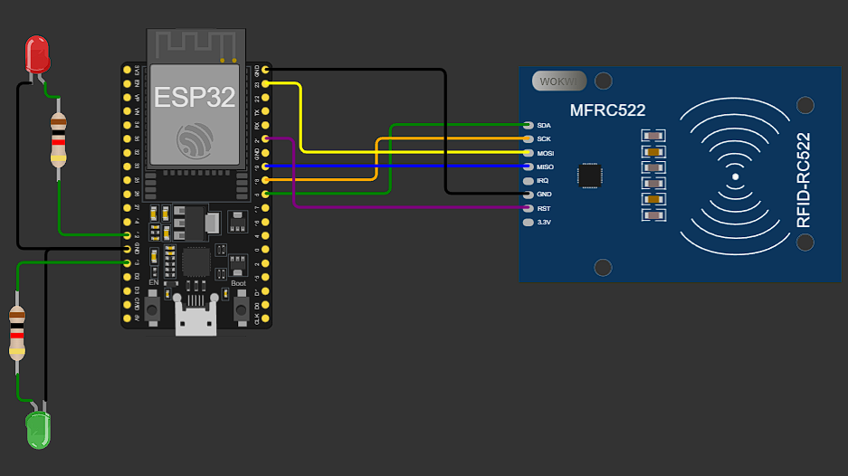

# ClassTrack 
### Smart RFID-based Attendance Management System

**ClassTrack** is a high-performance, end-to-end automated attendance tracking ecosystem. It integrates custom hardware (ESP32), a robust Node.js backend, and a modern React frontend to eliminate the friction of manual attendance marking.

---

## System Architecture

ClassTrack follows a distributed architecture ensuring real-time synchronization between physical classrooms and digital records:

1.  **Hardware Layer (ESP32/RFID)**: Captures physical tags and transmits data via secure API calls.
2.  **Backend Layer (Node.js/Express)**: The "Brain" that handles context identification, authentication, and session management.
3.  **Data Layer (Prisma/PostgreSQL)**: Relational storage for users, schedules, venues, and attendance records.
4.  **Frontend Layer (React/Tailwind)**: Role-specific dashboards for data visualization and management.

---

## Live Demo & Simulations

- **Frontend Application:** [classtrack-vitap.netlify.app](https://classtrack-vitap.netlify.app/)
- **Backend API:** [classtrack-backend.vercel.app](https://classtrack-backend.vercel.app/)
- **Attendance Simulator:** [Tap Simulator Interface](https://classtrack-backend.vercel.app/simulate)
- **Hardware Simulation:** [Wokwi ESP32 Project](https://wokwi.com/projects/462120199527289857)

---

## Key Features & User Roles

### Administrator
- **Infrastructure Management**: Define University Blocks, Rooms, and register RFID Readers.
- **Academic Scheduling**: Create Courses and map them to specific Time Slots and Venues.
- **User Lifecycle**: Manage Student and Faculty profiles with unique RFID associations.
- **Global Analytics**: Overview of attendance trends across the entire institution.

### Faculty
- **Automated Session Control**: Open or Close attendance sessions by simply tapping their RFID card at the classroom door.
- **Live Monitoring**: View real-time logs of students tapping in as they enter.
- **Reporting**: Export detailed attendance matrices (CSV format) for any course session.
- **Class Analytics**: Visualize attendance percentages and identify low-attendance students.

### Student
- **Personal Dashboard**: Track attendance percentage for each enrolled course.
- **Attendance History**: View a chronological list of all recorded entries with timestamps and locations.
- **Progress Tracking**: Visual indicators for attendance health (e.g., alert if below 75%).

---

## Core Intelligence: The "Tap" Logic

The system features a **Context-Aware Attendance Engine** that intelligently processes every RFID tap:

- **Identity Resolution**: Maps RFID UIDs to specific users and their roles.
- **Venue Context**: Identifies the classroom based on the `deviceIdentifier` of the RFID reader.
- **Time-Slot Matching**: Cross-references the current time with the academic schedule to find the `ONGOING` class in that venue.
- **State Management**:
    - **Faculty Tap**: Starts a session if none exists, or closes an open session.
    - **Student Tap**: Records attendance ONLY if a session is currently `OPEN` by the faculty.
- **Guardrails**:
    - **Cooldowns**: 15-second window between taps to prevent duplicate records.
    - **Enrollment Check**: Prevents students from marking attendance in classes they aren't enrolled in.
    - **Auto-Closure**: Automatically closes sessions if the scheduled class time expires.

---

## Tech Stack

| Layer | Technology |
| :--- | :--- |
| **Frontend** | React 19, Vite, Tailwind CSS 4, Lucide React, Axios |
| **Backend** | Node.js (ESM), Express 5, Prisma ORM, JWT |
| **Database** | PostgreSQL (Neon Database) |
| **Hardware** | ESP32, RFID-MFRC522 |
| **Deployment** | Netlify (Frontend), Vercel (Backend), Neon (Database) |

---

## Project Structure

```text
classtrack/
├── backend/                  # RESTful API
│   ├── prisma/schema.prisma  # Data models & relationships
│   ├── routes/               # Modular routes (Auth, Admin, Faculty, etc.)
│   ├── middleware/           # Role-based authorization
│   └── public/               # Static assets & Tap Simulator
├── frontend/                 # Interactive UI
│   ├── src/pages/            # Dashboard implementations
│   ├── src/components/       # Reusable UI components
│   └── src/api/              # Backend service connectors
└── hardware/                 # IoT Implementation
    ├── sketch.ino            # ESP32 Logic (WiFi + HTTP)
    └── diagram.png           # Circuit layout
```

---

## Development Setup

### 1. Backend Setup
```bash
cd backend
npm install
# Configure .env:
# DATABASE_URL="postgresql://..."
# JWT_SECRET="your_secret"
# APP_TIMEZONE="Asia/Kolkata"
npm run dev
```

### 2. Frontend Setup
```bash
cd frontend
npm install
# Configure .env:
# VITE_API_URL="http://localhost:5000"
npm run dev
```

### 3. Hardware (Optional)
Upload `hardware/sketch.ino` to your ESP32 using Arduino IDE. Ensure the `api_url` in the code points to your backend.

---

## Testing & Simulation

**Don't have hardware?** No problem!
1.  Open the [Tap Simulator](https://classtrack-backend.vercel.app/simulate).
2.  Use the **Device ID** of a registered reader (e.g., `00:11:22:33`).
3.  Enter a user's **RFID UID** from the table below.
4.  Observe the real-time feedback on the dashboards.

### Test Credentials (Password: `12345678`)

| Role | Email | RFID UID |
| :--- | :--- | :--- |
| **Admin** | `admin@classtrack.com` | `00:00:00:00` |
| **Faculty 1** | `faculty1@classtrack.com` | `de:ad:be:ef` |
| **Faculty 2** | `faculty2@classtrack.com` | `11:22:33:44` |
| **Student 1** | `student1@classtrack.com` | `55:66:77:88` |
| **Student 2** | `student2@classtrack.com` | `aa:bb:cc:dd` |
| **Student 3** | `student3@classtrack.com` | `04:11:22:33` |
| **Student 4** | `student4@classtrack.com` | `c0:ff:ee:99` |

---

## Hardware Diagram



---
